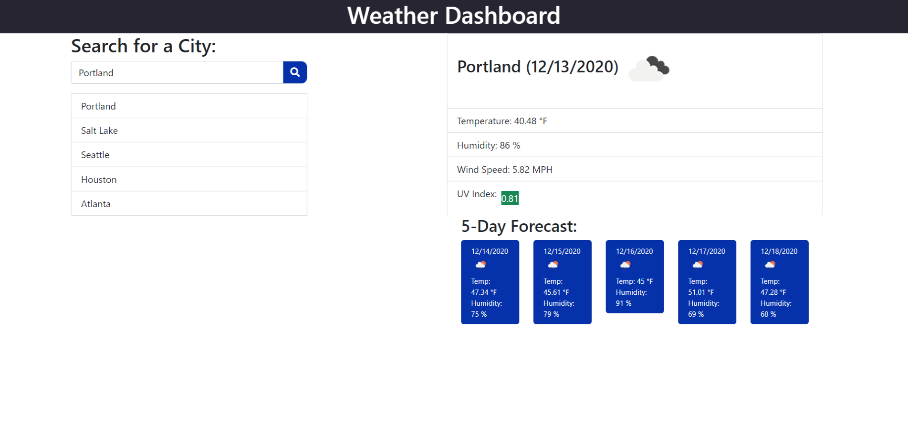

# Weather Dashboard

## Function
* Weather forcast with data pulled using openweathermaps api.
* When city is searched weather for current day and five day forecast is displayed.
* City search history is created for previous searches.

### Built With
* HTML
* CSS
* JavaScript
* Luxon
* jQuery
* Bootstrap

### Link
[Deployed application](https://corycalaway.github.io/weather-dashboard/)

### Daily Planner Layout
